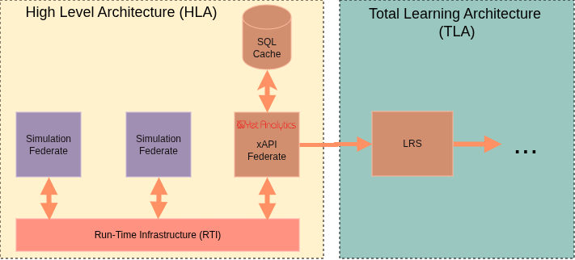

## What is the xAPI HLA Federate?

An HLA federate capable of converting HLA RTI data into xAPI Statements and storing them in a Learning Record Store.

### High Level Architecture (HLA) & Run-Time Infrastructure (RTI)

In the SISO HLA model, simulation Federations are a collection of Federates passing messages to each other over a communication protocol called RTI, which functions much like a bus.

The Federates are made to speak the same "language" with the use of a Federated Object Model (FOM) which is an XML schema of possible Objects and Interactions and their datatypes. All federates on a federation must share the same FOM.

### The xAPI Federate Basics



- The xAPI Federate is given the relevant FOM and joins the HLA Federation where the simulation is taking place.

- The federate listens for Interactions or updates to Objects on the RTI, and is configured to emit xAPI Statements based on certain criteria.

- Data from the RTI is injected directly into xAPI Statements, and they are sent to a configured LRS.

- The Federate can be configured to cache Object state while it listens to the RTI, creating a model of all specified Objects, which can be accessed during statement creation. Could also be accessed directly for BI/Reporting needs.

### Injection Syntax

#### Simple Reflective Injection
This is for getting data from the event (interaction or object update) itself directly, and just needs a target e.g.

```
["this", ["EntityId"]]
["this", ["FromPosition", "X"]]
```

#### Query Injection
This syntax is for querying the Object state cache, and needs the Class, Target attribute, and query Criteria


```
["query", "Rabbit", ["FirstName"], [["EntityId"], "=", "12345"]]
```
The above says: "Inject the `FirstName` of a `Rabbit` Object where `Rabbit.EntityID` equals `12345`"


#### Inline Syntax
Either of the above formats can be used in the middle of an existing JSON string with a small escape syntax change like so:

```
  ... 
  "id": "http://yetanalytics.com/objects/<<[\"this\", [\"ObjectId\"]]>>",
  ...
```

### License and Background

- Open Source Apache 2.0 License
- Currently in development, open in public (as of June 2026)
- Based on work with LTSC <> SISO (FOM->xAPI) Working Group
- Universal Adapter, Domain Agnostic, just needs
  - Valid FOM
  - Statements you want to produce


